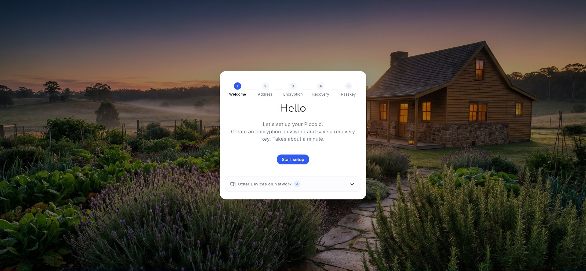
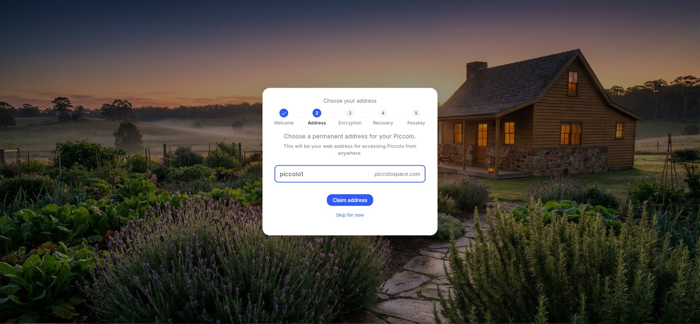
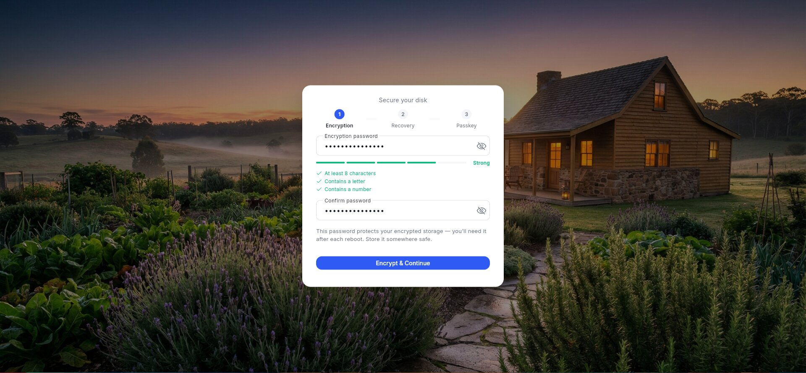
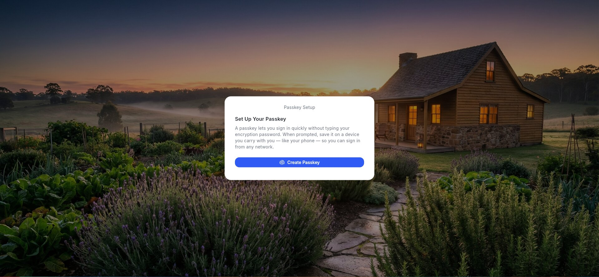
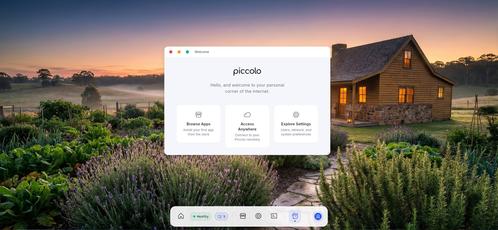
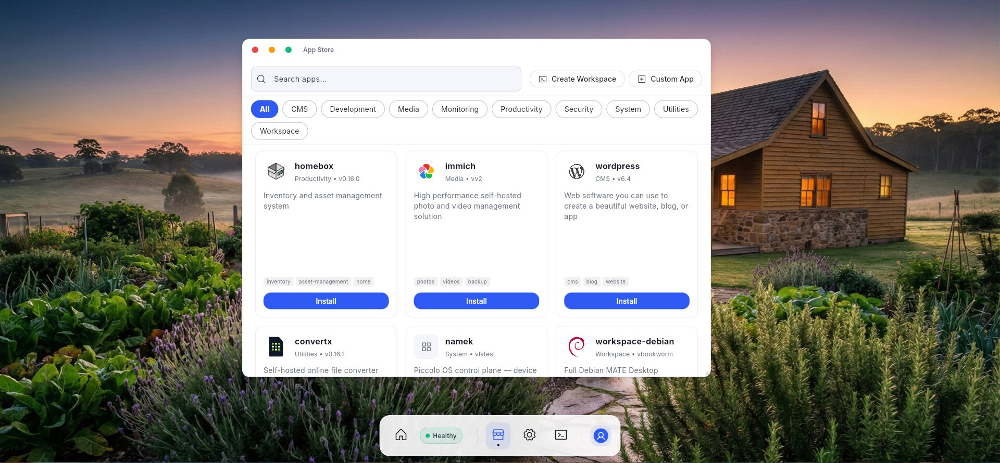
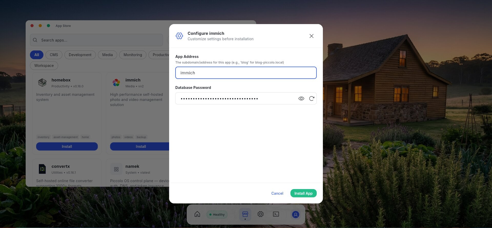
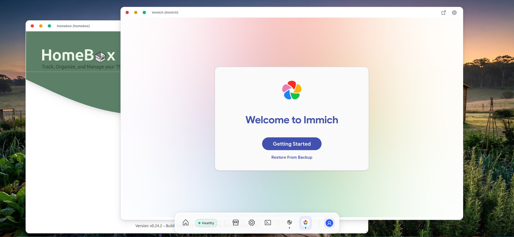
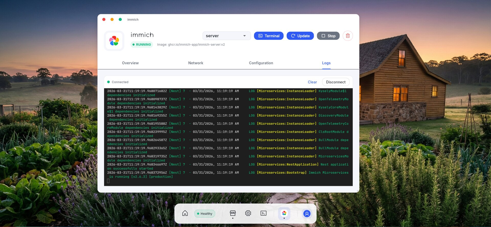
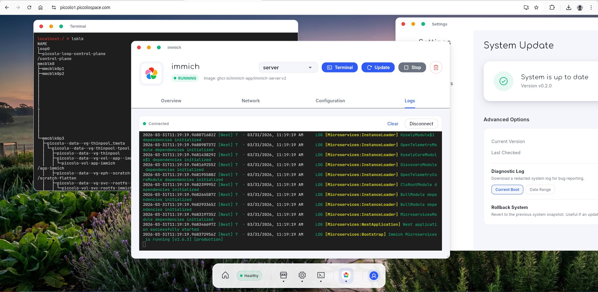

# Piccolo OS  

A privacy-first, headless operating system for homelabs — self‑host services on your own hardware with one‑click app deployment and encrypted remote access.

> Piccolo OS is in alpha. Install, portal, app deployment, encrypted volumes, and remote access work today. Expect rough edges — [file issues](https://github.com/AtDexters-Lab/piccolo-os/issues) and we'll fix them.

---

## Table of Contents
- [Install and Quick Start](#install-and-quick-start)
- [Why Piccolo OS](#why-piccolo-os)
- [See It in Action](#see-it-in-action)
- [System Architecture](#system-architecture)
- [Deployment Options](#deployment-options)
- [The Piccolo Ecosystem](#the-piccolo-ecosystem)
- [Contribute](#contribute)

---

## Install and Quick Start

Piccolo OS is built for **x86_64** and **ARM64**. The easiest way to try it is in a Virtual Machine or by flashing it to a USB drive/SD card for bare metal.

> **Tip: Faster Downloads**
> Browser downloads can be slow for large OS images. We recommend using a download manager like `aria2c` with multiple streams.
> ```bash
> # Example: Download with 16 connections
> aria2c -x 16 <image-url>
> ```

### Option 1: VirtualBox (Try it now)
*Perfect for testing the portal and "time-to-first-service" experience on your laptop.*

1.  **Download:** [piccolo-os.x86_64-VirtualBox.vdi.xz](https://download.opensuse.org/repositories/home:/atdexterslab:/piccolo-os/home_atdexterslab_atdexterslab_tumbleweed/piccolo-os.x86_64-VirtualBox.vdi.xz)

2.  **Extract:** Unzip the file to get the `.vdi` disk image.
    ```bash
    unxz piccolo-os.x86_64-VirtualBox.vdi.xz
    ```

3.  **Resize Disk (Mandatory):** The VDI images are compact. You **must** resize them to at least 24GB before attaching, otherwise the OS will fail to boot.
    ```bash
    # Example: Resize to 24GB (24 * 1024 = 24576 MB)
    VBoxManage modifymedium disk piccolo-os.x86_64-VirtualBox.vdi --resize 24576
    ```

4.  **Create VM:**
    *   **Type:** Linux / openSUSE (64-bit).
    *   **Hardware:** 4GB RAM (Rec.), 2 vCPUs.
    *   **Disk:** "Use an Existing Virtual Hard Disk File" -> Select the extracted `.vdi`.

5.  **Configure (Critical):**
    *   **System:** Enable **EFI** (Motherboard -> Enable EFI). *Piccolo OS requires UEFI.*
    *   **Network:** Set Adapter 1 to **Bridged Adapter** (so it gets a LAN IP and is reachable).

6.  **Boot:** Start the VM. Within ~60 seconds, access the portal at `http://piccolo.local`.

### Option 2: Hardware (x86_64 & ARM64)
*Runs directly on generic x86_64 (Intel/AMD) and ARM64 hardware (UEFI).*

#### Method A: Installer ISO (Recommended for Installation)
Use this if you want to install Piccolo OS to your computer's **internal drive**.

**Downloads:**
*   **x86_64 (Intel/AMD):** [piccolo-os.x86_64-SelfInstall.iso](https://download.opensuse.org/repositories/home:/atdexterslab:/piccolo-os/home_atdexterslab_atdexterslab_tumbleweed/iso/piccolo-os.x86_64-SelfInstall.iso)
*   **ARM64 (Generic):** [piccolo-os.aarch64-SelfInstall.iso](https://download.opensuse.org/repositories/home:/atdexterslab:/piccolo-os/home_atdexterslab_atdexterslab_tumbleweed/iso/piccolo-os.aarch64-SelfInstall.iso)

1.  **Burn:** Write the ISO to a USB stick using [BalenaEtcher](https://etcher.balena.io/), Rufus, or `dd`.
2.  **Boot:** Insert the USB drive, boot from it, and follow the on-screen prompts to install to your hard drive.

#### Method B: Raw Image (Live USB or Direct Flash)
Use this to **"Try Now"** from a USB stick without touching your internal drive, or to flash directly to a drive.

**Downloads:**
*   **x86_64 (Intel/AMD):** [piccolo-os.x86_64-SelfInstall.raw.xz](https://download.opensuse.org/repositories/home:/atdexterslab:/piccolo-os/home_atdexterslab_atdexterslab_tumbleweed/piccolo-os.x86_64-SelfInstall.raw.xz)
*   **ARM64 (Generic):** [piccolo-os.aarch64-SelfInstall.raw.xz](https://download.opensuse.org/repositories/home:/atdexterslab:/piccolo-os/home_atdexterslab_atdexterslab_tumbleweed/piccolo-os.aarch64-SelfInstall.raw.xz)

1.  **Flash:** Write the image to a USB stick (for Live/Try Now) or directly to an SSD (for Install) using [BalenaEtcher](https://etcher.balena.io/) or `dd`.
    ```bash
    # Example for x86_64
    xzcat piccolo-os.x86_64-SelfInstall.raw.xz | sudo dd of=/dev/sdX bs=4M status=progress
    ```

2.  **Boot:**
    *   Insert the drive into your machine.
    *   Power on. **UEFI Secure Boot is fully supported** and recommended.
    *   Connect Ethernet.

3.  **Setup:** Access `http://piccolo.local` from another device on the same LAN.

### Option 3: ARM64 (Raspberry Pi & Rock64)
*Board-specific optimized images (bootloader/firmware pre-configured).*

*   **Raspberry Pi (3+/4/5):** [piccolo-os.aarch64-RaspberryPi.raw.xz](https://download.opensuse.org/repositories/home:/atdexterslab:/piccolo-os/home_atdexterslab_atdexterslab_tumbleweed/piccolo-os.aarch64-RaspberryPi.raw.xz)
*   **Rock64:** [piccolo-os.aarch64-Rock64.raw.xz](https://download.opensuse.org/repositories/home:/atdexterslab:/piccolo-os/home_atdexterslab_atdexterslab_tumbleweed/piccolo-os.aarch64-Rock64.raw.xz)

Follow the **Method B (Raw Image)** instructions from Option 2. Ensure your board is connected to Ethernet.

### Troubleshooting: Can't reach piccolo.local?

mDNS (`.local` resolution) doesn't work on every network. If the address doesn't resolve:

1. **Find the IP directly:** Check your router's DHCP lease list for a device named `piccolo` and use the IP (e.g., `http://192.168.1.42`).
2. **From your LAN:** `arp -a` or `ping piccolo.local` from another device on the same network.
3. **VirtualBox users:** Make sure the network adapter is set to **Bridged Adapter**, not NAT — this is the most common cause.

---

## Why Piccolo OS
- **Self-host with confidence:** If you can flash a USB drive, you can run a home server.
- **Local-first:** Fully usable on LAN with no cloud dependency.
- **Open by design:** Piccolo OS and remote access (Namek + Nexus) are open source.
- **Free remote access:** Always free — self‑hosted or managed via Piccolo Network.
- **Secure by default:** Device‑terminated TLS, encrypted data, hardened base OS.

---

## See It in Action

**First boot** — open `http://piccolo.local` and start setup


<details>
<summary><strong>Full setup walkthrough</strong> — 3 more steps, takes about a minute (click to expand)</summary>
<br>

**Claim your address** — pick a `piccolospace.com` subdomain for remote access


**Encrypt your data** — set an encryption password for all stored data


**Create a passkey** — sign in remotely without typing your encryption password (phone, laptop, or security key)


</details>

**Your portal** — browse apps, access remotely, and manage settings from one place


**App Store** — browse by category, install with one click


**Install an app** — one form, one click


**All your apps, one interface** — Homebox and Immich running side by side in the portal


**App management** — live logs, controls, and updates for every running app


**Remote access** — the same portal over HTTPS at your `piccolospace.com` address, with terminal and system settings


---

## System Architecture
```
+---------------------------------------------------+
|          Layer 3: Your Applications               |
|       (App Store + custom containers)              |
+---------------------------------------------------+
|           Layer 2: System Apps                    |
| (Platform services: storage, federation, DB, etc.)|
+---------------------------------------------------+
|           Layer 1: Host OS + piccolod             |
|   (SUSE MicroOS, piccolod orchestrator/proxy)     |
+---------------------------------------------------+
|           Layer 0: Hardware                       |
|   (x86_64 PCs/mini‑PCs; Raspberry Pi 4/5;         |
|    TPM 2.0 optional but recommended)              |
+---------------------------------------------------+
```

### Design Principles
- **Immutable base:** Built on SUSE MicroOS (read‑only root, transactional updates, rollback).
- **Container‑native:** Podman + systemd; rootless by default for managed apps.
- **Device‑terminated TLS:** Certificates and keys live on the device.
- **Strong data protection:** Per‑directory encryption (gocryptfs‑style), password‑derived keys, optional TPM assist, and a recovery key.

### What You Can Do Today
- **Headless operation:** Access the admin portal at `http://piccolo.local` (Ethernet‑only).
- **One‑click app deployment:** Vaultwarden, Immich, Uptime Kuma, WordPress, Homebox, Code Server, and more from the open source App Store.
- **Encrypted volumes:** Per‑directory encryption with gated unlock and recovery key support.
- **Updates:** Transactional OS updates with rollback; app updates and revert.
- **Remote access:** Publish over HTTPS with device‑terminated TLS. Self‑host Namek + Nexus or use Piccolo Network.

### Remote Access Model
- **Three‑component architecture:** [Namek Server](https://github.com/AtDexters-Lab/namek-server) (orchestrator) coordinates between [piccolod](https://github.com/AtDexters-Lab/piccolod) (on device) and [Nexus Proxy](https://github.com/AtDexters-Lab/nexus-proxy-server) (edge relay). All three are open source and self‑hostable.
- **Certificates:** Device issues/renews its own certs via Let’s Encrypt; Namek orchestrates DNS‑01 challenges.
- **Nexus Proxy TLS:** Nexus manages its own cert via ACME TLS‑ALPN‑01; it does not terminate device traffic.
- **SSO continuity:** After signing into the portal, apps open without a second login (local proxy ports or remote listener hosts). Third‑party apps never see the portal cookie; the proxy gates access.

---

## Deployment Options

Remote access is always free — self‑hosted or managed.

### 1. Self‑Hosted
Run your own [Namek Server](https://github.com/AtDexters-Lab/namek-server) + [Nexus Proxy](https://github.com/AtDexters-Lab/nexus-proxy-server). Full control over every service, every update, every byte.

### 2. Piccolo Network (Managed)
- Managed remote access — zero setup required.
- Federated encrypted storage (planned, subscription).
- Remote updates (planned).

---

## The Piccolo Ecosystem

| Component | Role |
|-----------|------|
| **[piccolo-os](https://github.com/AtDexters-Lab/piccolo-os)** | **OS images, install guides, and project hub (this repo)** |
| [piccolod](https://github.com/AtDexters-Lab/piccolod) | On‑device daemon — portal, app management, encryption |
| [namek-server](https://github.com/AtDexters-Lab/namek-server) | Orchestrator — device auth, DNS, certificates |
| [nexus-proxy-server](https://github.com/AtDexters-Lab/nexus-proxy-server) | Edge relay — remote access with device‑terminated TLS |
| [piccolo-store](https://github.com/AtDexters-Lab/piccolo-store) | App catalog — manifests for installable apps |

---

## Contribute

Piccolo OS exists to make self‑hosting practical on hardware you own.
We’re early, scrappy, and community‑powered. PRs, issues, and design discussions are welcome.

### Build Infrastructure
Piccolo OS is built transparently on the Open Build Service (OBS).
- **RPMs (piccolod, support):** [home:atdexterslab](https://build.opensuse.org/project/show/home:atdexterslab)
- **OS Images (ISO/VDI):** [home:atdexterslab:piccolo-os/images](https://build.opensuse.org/package/show/home:atdexterslab:piccolo-os/images)
- **Artifacts/Downloads:** [Repository Browser](https://download.opensuse.org/repositories/home:/atdexterslab:/piccolo-os/home_atdexterslab_atdexterslab_tumbleweed/)

### Local Development
```bash
git clone https://github.com/AtDexters-Lab/piccolo-os
cd piccolo-os
# See kiwi/ directory for image definitions and packages/ for RPM specs.
```

### Join the Conversation
- [GitHub Issues](https://github.com/AtDexters-Lab/piccolo-os/issues)
- [GitHub Discussions](https://github.com/AtDexters-Lab/piccolo-os/discussions)
- [Follow on LinkedIn](https://www.linkedin.com/company/piccolo25/)

---

## License
Piccolo OS is free and open source under the [AGPL‑3.0](./LICENSE).
